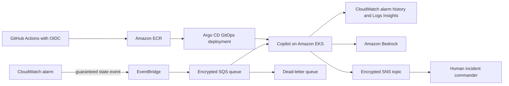

# Architecture

## Design choices

- **Asynchronous intake:** EventBridge and SQS absorb alarm bursts, retry transient failures, and
  isolate the alarm path from model latency.
- **Bounded context:** the worker reads five alarm transitions and at most 40 recent log lines.
- **Least privilege:** EKS Pod Identity supplies short-lived AWS credentials. There are no static
  cloud secrets in GitHub or Kubernetes.
- **Human control:** the model produces structured recommendations. It cannot run commands, mutate
  the cluster, or deploy a rollback.
- **Auditable delivery:** Terraform creates cloud resources; GitHub Actions tests and scans; Argo CD
  reconciles reviewed manifests.

## Failure behavior

An analysis failure leaves the message in SQS. After four receives, SQS moves it to the encrypted
dead-letter queue. Operators alarm on DLQ depth and can redrive after correcting the cause. Bedrock
output is schema-validated before notification, so malformed model output is retried rather than
silently accepted.

